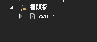

inlcude與lib資料夾放到工程目錄\
\
組態:所有組態	平台:所有平台\
屬性->VC++->Include目錄 => 加入include\、include\opencv2\\\
\
屬性->VC++->程式庫目錄 => 加入lib\\\
\
完成後按下套用:\
\


組態:Debug	平台:所有平台\
屬性->連結器->輸入 => 加入opencv_world420d.lib\
\

組態:Release	平台:所有平台\
屬性->連結器->輸入 => 加入opencv_world420.lib\
\

將dll資料夾中的所有.dll檔放到工程目錄下\
\

將組態改為x64\
\

將Lenna.jpg放到工程目錄下，並測試程式:
```cpp
#include<opencv2/opencv.hpp>
using namespace cv;
int main()
{
Mat img = imread("Lenna.jpg");
imshow("Hello World!", img);
waitKey();
}
```

運行結果:\
\

UI安裝:\
將cvui.h放到工程目錄下\
標頭檔加入cvui.h\
\
並測試程式:\
```cpp
#include <opencv2/opencv.hpp>
#define CVUI_IMPLEMENTATION
#include "cvui.h"

#define WINDOW_NAME "rgb to gray"
using namespace cv;
int main() {
    cvui::init(WINDOW_NAME);
    cv::Mat frame = cv::Mat(cv::Size(340, 380), CV_8UC3);

    Mat origin = imread("Lenna.jpg");
    Mat img;
    origin.copyTo(img);
    while (cv::getWindowProperty(WINDOW_NAME, 0) >= 0) {
        frame = cv::Scalar(49, 52, 49);
        //cvui::text(frame, 10, 10, "Hello world!");
        //
        if (cvui::button(frame, 10, 10, 160, 30, "rgb")) {
            //img = imread("Lenna.jpg");
            origin.copyTo(img);
        }
        if (cvui::button(frame, 170, 10, 160, 30, "gray")) {
            for (int i = 0; i < img.rows; i++)
            {
                for (int j = 0; j < img.cols; j++)
                {
                    Vec3b bgr = img.at<Vec3b>(i, j);
                    uchar gray_value = 0.114 * bgr[0] + 0.587 * bgr[1] + 0.299 * bgr[2];
                    img.at<Vec3b>(i, j)[0] = gray_value;
                    img.at<Vec3b>(i, j)[1] = gray_value;
                    img.at<Vec3b>(i, j)[2] = gray_value;
                }
            }
        }
        cvui::image(frame, 10, 50, img);
        // Update cvui internal stuff
        cvui::update();

        // Show window content
        cv::imshow(WINDOW_NAME, frame);


        if (cv::waitKey(20) == 27) {
            break;
        }
    }

    return 0;
}
```