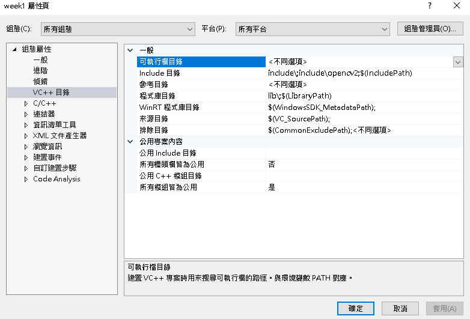
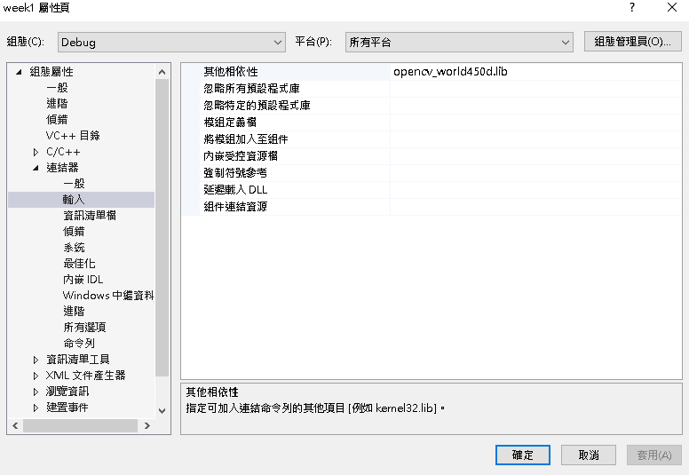
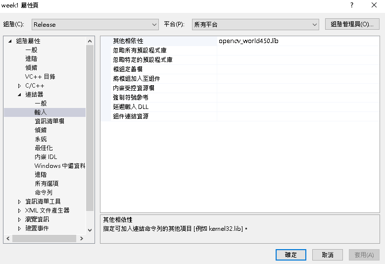

inlcude與lib資料夾放到專案預設根目錄

組態:所有組態	平台:所有平台
屬性->VC++->Include目錄 => 加入include、include\opencv2

屬性->VC++->程式庫目錄 => 加入lib\

完成後:

組態:Debug	平台:所有平台
屬性->連結器->輸入 => 加入opencv_world450d.lib

組態:Release	平台:所有平台
屬性->連結器->輸入 => 加入opencv_world450.lib
